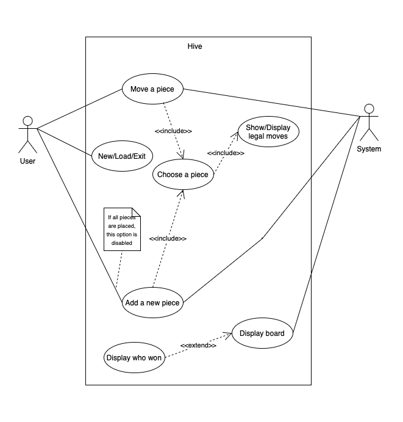
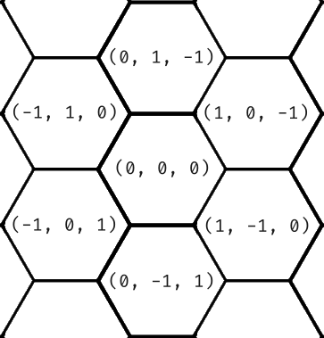
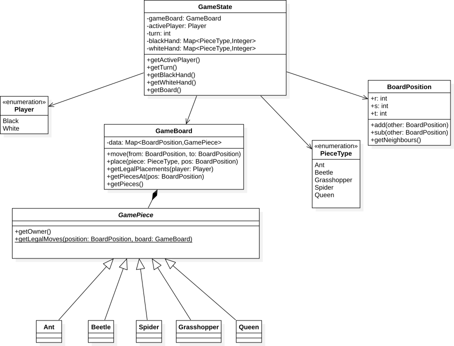

# CMPT 276 Project - Team Meerkat

### Introduction

Welcome to the world of Hive, an intriguing and strategic board game that will put your tactical skills to the test. In this game, you will take on the role of a cunning insect monarch, commanding a swarm of loyal creatures to outmaneuver your opponent and claim dominance over the Hive.

High-Level Design Choices:

1. Concept: Hive is a two-player, turn-based board game that simulates a battle between two colonies of insects. The game board represents a hexagonal grid, resembling the layout of a beehive, where players strategically place and move their insect tiles.

2. Tiles and Abilities: The game consists of different types of insect tiles, each with unique abilities and movement patterns. For example, the Queen Bee is the most crucial piece, needing to be protected at all costs, while other insects like beetles, grasshoppers, ants, and spiders possess their own specialized movement abilities.

3. Placement and Movement: The game begins with an empty board, and players take turns placing their tiles. Once placed, tiles can be moved to new positions, but they must always remain connected to the hive. Movement options vary for each insect type, allowing for strategic positioning and encircling the opponent's pieces.

4. Game Objectives: The primary objective is to surround the opponent's Queen Bee, effectively trapping it and claiming victory. However, there are alternative ways to win, such as capturing the opponent's key pieces or forcing their Queen Bee into an immovable position.

5. Strategic Depth: While easy to learn, Hive offers a remarkable depth of strategy. Planning several moves ahead, anticipating the opponent's actions, and adapting to changing situations are key elements for success.

In conclusion, Hive is a captivating board game that offers an engaging and tactical experience for players of all ages. With its unique insect-themed gameplay, intuitive rules, and depth of strategy, Hive promises hours of challenging and enjoyable gameplay. 

\pagebreak

### Architecture
{width=100%}

The implicit hexagonal board used to play Hive requires special considerations
for a proper implementation. Due to the sparse nature and the possibility of
pieces moving indefinitely in any direction, array-based storage of the
board is impractical. We have chosen to use a map-based storage, indexed
by a hexagonal coordinate system. This coordinate system is derived from
a three-dimensional grid of cubes and was chosen as the coordinates can be
added and subtracted without any special handling. 

{width=50%}

Storing the game pieces in a map solves both the issues of the sparse tiles and
the unbounded game field - the amount of memory required is only proportional
the the amount of tiles in play. However, the Beetle piece provides an additional
challenge: multiple pieces can occupy the same coordinate. This problem is solved
by associating each coordinate with a stack of pieces rather than a single piece.

Each type of piece has different methods of movement, but they are otherwise
identical. As it does not make sense for any piece to inherit from another,
each game piece will inherit from the same abstract class instead.
{width=100%}

### User stories
This game will have two people playing against each other. Each side has five different characters,
Queen Bee, Beetle, Grasshopper, Spider, Soldier Ant,each insect serves a different purpose.

First, this is the function of each piece.
The Queen Bee can move one space at a time.
The Spider must move exactly three spaces per turn.
The Beetle can move one space and also has the ability to climb on top of other pieces, effectively 'pinning' them down.
The Grasshopper jumps over other pieces in a straight line.
The Soldier Ant can move around the hive as far as it wants.

When we start playing this game, the following functions will help us play Hive very well.

1. Game Pause and Resume: As a player sharing a device with my friend, we need to pause our game for a snack break. We tap a new 'Pause' button, and the game freezes in its current state. When we're ready to continue, we tap 'Resume', and our game picks up right where we left off. This feature helps us maintain our gaming experience despite interruptions.

2. In-Game Rule Book: As a new player learning to play Hive with my friend on the same screen, I'm glad to find an 'In-Game Rule Book' in the app's menu. This feature lets us quickly refer to the rules and piece movements without needing to leave the game or use another device. This keeps us focused on enjoying the game and learning as we play.

3. AI Versus AI Mode: As a player looking to learn more about strategy in Hive, I notice a new mode: 'AI Versus AI'. I select this mode, and the game starts with two AI players facing off. As I watch them play, I learn from their strategies and tactics, better preparing me for my own games.

### User Story - Watch and Learn Tutorials (Learner's perspective):

As a new player trying to grasp the basics of Hive, I decide to try the 'Interactive Tutorials'. Instead of just text explanations, the tutorial starts an AI versus AI game and narrates the strategies and thought processes behind each move. This interactive and immersive experience helps me understand the game dynamics much more effectively.

### User Story - Save and Load Games (Friend's perspective):

As a player who often plays long games with my friend on the same device, I'm thrilled to discover a new 'Save Game' feature. Now, when we have to stop playing, we can save our game state and resume from exactly where we left off next time.

### User Story - Customization:

 Mergatroid Hooperbag, a passionate and enthusiastic player, has just discovered Hive game – a game known for its strategic and insects-theme pieces. She is captivated to the game's strategic depth and the tactile beauty of the pieces, but she yearns for a personalized gaming experience comparing to other board games like chess. With the Hive game’s customization system, she finds her needs met. She is given choices to customise her gameplay as soon as she starts the game, including the ability to change the board's theme and the colour and style of her bug pieces. This allows Mergatroid to immerse herself in a game that feels like her own, tailored to her visual preferences.

### User Story - Undo:

 Fartbuns Beeman is an experienced player in Hive, but occasionally makes a mistake because of the complex strategy. On a beautiful Saturday evening, he is practicing in a tough match against the AI. Suddenly, he realizes he's made a potentially game-losing mistake by placing his ant in the wrong spot. But Hive has an undo feature. With a click, he retracts his move, revaluates his strategy, and continues the match, a crisis averted and his enjoyment of the game uninterrupted.

### User Story - Tutorial:

 The game's distinctive, bug-themed gameplay intrigues Crapps Kingfish, a rookie to Hive, but he finds the rules to be a little intimidating. On a beautiful Sunday afternoon, he fires up the game, eager to learn but unsure of where to begin. Thankfully, the game includes a clear and engaging tutorial. It leads Crapps Kingfish through many scenarios, demonstrating the special moves of each piece and even providing tactical guidance. With the aid of the tutorial, he builds self-assurance and starts to gradually master the game's mechanics, converting what could have been a frustrating experience into a fun learning experience.

\newpage

### Requirements

### Functional requirements:

| REQUIREMENTS | DESCRIPTION |	
| --- | --- |
| Game UI |	An interactable game interface; enabling users to easily interact with the game.  Players should be able to interact with the game without any difficulty |
| Turn-Based Gameplay |	The game should enforce turn-based gameplay, allowing each player/AI to take their turns alternately |
| Moveable Game Pieces | Players and the computer (AI) need to be able to move the game pieces, sticking to the official Hive game rule |
|Valid Movement| The game should validate the moves made by players, ensuring they follow the movement rules of each piece type |
| Game States (Pause/Save/Load)	| Game has a functional Pause/Save/Load states for players, allowing players to save and resume gameplay at their convenience|
| Win/Lose Condition | The game should be able to accurately detect Win/Lose conditions based on the state of the queen bee piece (i.e., whether it is surrounded) |
|Game Restart| Players should have the option to restart the game once it has ended|

### Non-functional requirements:

| REQUIREMENTS | DESCRIPTION |	
| --- | --- |
| Performance |	The game should load considerly fast with good latency |
| Compatable | The game should be compatible across multiple platforms, including Windows, Mac, and Linux |
| Usability | The user interface should be intuitive and easy to use; allowing players to understand how to navigate and play the game without extensive instructions |
| Frame Rate (FPS) | The game should has a considerable decent frame rate to function; providing a smooth and immersive experience for players |
| Maintenance | The game's codebase has to be organised and well-documented in order to make upgrades and bug patches simple |
|Rules Enforcement| The game should enforce the rules of Hive, preventing players from making illegal moves or violating the game's mechanics|
|Error Handling| The game should provide informative error messages and handle exceptions gracefully, allowing players to understand and recover from any issues that may arise during gameplay|

